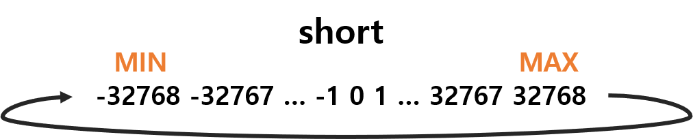
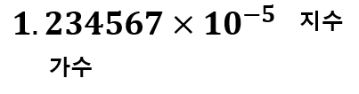
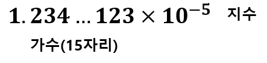

02 자료형
===

# 1. 변수와 상수

## 변수와 상수

프로그램에는 반드시 데이터를 저장할 공간이 있어야 합니다. 예를 들어 학생들의 성적의 평균을 계산하는 프로그램이라면, 각각의 학생들의 성적이 입력되면 프로그램 어딘가에 그 학생들의 성적이 저장되어 있어야 합니다. 이때 사용하는 것이 **변수**입니다.

변수는 데이터를 담아두는 상자와 같다고 볼 수 있습니다. **변수는 언제든지 다른 값으로 변경이 가능합니다.** 반면에 값이 한번 정해지면 값을 변경할 필요가 없는 데이터들도 존재합니다. 

## 상수

- 100
- 3.14
- 'A'
- "Hello World!

이런 데이터를 **상수**라고 합니다. 상수는 프로그램이 실행되는 동안에 **값을 변경할 수 없습니다.**

상수라고 해서 꼭 정수나 실수만 존재하는 것은 아닙니다. 앞서 예제에서 보았던 "Hello World"라는 문자열도 실행 도중에 변하지 않기 때문에 상수입니다.

```c++
int main(){
    cout<<"Hello World!\n"; // 상수
    return 0;
}
```

## 변수 규칙

변수 이름은 몇가지 규칙이 있습니다. 변수 이름이나 함수의 이름은 모두 식별자의 일종 입니다. 식별자란 다른 것들과 구분되어 식별할 수 있는 것입니다. 그렇기에 구분을 위한 규칙이 있습니다.

- 식별자는 알파벳 문자와 숫자, 밑줄 문자('_')로 이루어집니다. 한글은 사용할 수 없습니다.

- 이름의 첫 번째 문자는 반드시 알파벳 또는 밑줄 문자여야 합니다. 그렇기에 숫자로 시작할 수 없습니다.

- 대문자와 소문자를 구별하기 때문에 서로 다른 것으로 취급됩니다. 따라서 index, Index, INDEX는 모두 서로 다른 변수입니다.

- **C++ 언어에서 지원하는 키워드(예약어)와 똑같은 이름은 허용되지 않습니다.**

- 변수의 길이에는 제한이 없습니다.

> 다음은 사용이 가능한 변수명 입니다.

```C++
sum
_count
number_of_pictures
King3
```

> 다음은 사용이 불가능한 변수명 입니다.

```c++
2nd_base            // 첫번째 문자는 숫자가 될 수 없습니다.
money#              // #은 사용할 수 없는 기호입니다.
best-student        // -는 사용할 수 없는 기호입니다.
double              // dobule은 c++의 키워드 입니다.
```

## 좋은 변수이름

좋은 변수 명은 코드를 볼 때 바로 그 의미를 알 수 있도록 정하는 것이 좋습니다.

년, 월, 일을 표현할 때 y, m, d 보다는 year, month, day가 더 의미를 파악하기에 좋습니다.

여러 단어로 이루어진 변수명이라면 kumoh_university 보다는 kumohUniversity로 단어의 구분을 대문자로 하는 방법이 좋습니다.

변수 이름을 지을 때 제일 중요한 것은 일관성이 있어야 합니다.

# 2. 자료형

자료형이란 데이터를 표현하는 형태를 의미합니다. 자료형의 종류가 많은 이유는 표현할 데이터의 종류와 크기가 다양하기 때문입니다.


# 3. 변수 선언

## 선언

> 자료형 변수명;

```c++
char c;
int size;
float pi;
double average;

int height, width;
```

## 초기화

변수를 선언하면서 값을 할당하는 것을 초기화라고 합니다. 초기화는 대입 연산자(=)를 통해서 할 수 있습니다.

```c++
char c = 'A';
int size = 20;
float pi = 3.14f;       //float형은 뒤에 f를 붙여줍니다.
double average = 1.4;

int height = 10, width = 20;
```

# 연습문제

1. 변수와 상수의 차이점?

2. 변수와 자료형의 관계?


# 4. 정수형

정수형은 가장 기본적인 데이터 타입으로 정수를 저장할 수 있습니다.


## 정수형이 다양한 이유?

수학에서 정수는 ..., -2, -1, 0, 1, 2, ... 와 같이 한가지 종류만 존재합니다. 하지만 컴퓨터 메모리의 크기는 한정되어 있기 때문에 한 가지 타입만으로는 모든 정수를 나타낼 수 없습니다. 

또한 프로그래머가 용도에 따라서 선택할 수 있습니다. 비트 수가 늘어나면 수의 표현 범위가 늘어나지만 그만큼 메모리 공간이 더 필요로 합니다. 따라서 다양한 크기의 자료형을 제공함으로써 필요에 따라 적당한 크기의 정수 자료형을 선택하여 사용하도록 하기 위함입니다.

## 정수 자료형의 크기

```c++
#include <iostream>
#include <climits>
using namespace std;	            // 이름 공간 설정

int main()
{
	short year = SHRT_MAX;		    // 최대값으로 초기화한다.
	int sale = INT_MAX;			    // 최대값으로 초기화한다.
	long total_sale = LONG_MAX;		// 최대값으로 초기화한다.

	cout <<"short형의 크기=" <<sizeof(short)<<endl;
	cout <<"int형의 크기=" <<sizeof(int)<<endl;
	cout <<"long형의 크기=" <<sizeof(long)<<endl<<endl;

	cout <<"short형의 최대값=" <<year<<endl;
	cout <<"int형의 최대값=" <<sale<<endl;
	cout <<"long형의 최대값=" <<total_sale<<endl<<endl;

	cout <<"short형의 최소값=" <<SHRT_MIN<<endl;
	cout <<"int형의 최대값=" <<INT_MIN<<endl;
	cout <<"long형의 최대값=" <<LONG_MIN<<endl<<endl;

	return 0;
}
```

> 결과

    short형의 크기=2
    int형의 크기=4
    long형의 크기=4

    short형의 최대값=32767
    int형의 최대값=2147483647
    long형의 최대값=2147483647

    short형의 최소값=-32768
    int형의 최대값=-2147483648
    long형의 최대값=-2147483648

## unsinged와 signed

unsigned : 변수가 양수만 나타낸다.
signed : 변수가 정수를 나타낸다.

unsigned를 사용하면 기존 보다 양수의 표현 범위가 넓어지게 됩니다. 기존 (signed) short의 표현 범위가 -32768 ~ 32767 까지라면, unsigned short는 0 ~ 65535 까지의 정수를 나타낼 수 있습니다. 

또한 unsigned는 해당 변수가 양수만을 표현할 것을 명시하는 역할을 하기 때문에 프로그래밍 실수를 방지할 수 있습니다.

## 오버플로우

오버플로우(Overflow)란 사전에선 '범람하다'로 해석됩니다. 프로그래밍에서는 자료형의 표현 범위를 넘어선 값이 들어가면서 생기는 오류를 의미합니다. 표헌 범위를 넘어버렸다고(범람) 보는거죠. 아래 코드를 한번 살펴보겠습니다.



```c++
#include <iostream>
#include <climits>
using namespace std;

int main(){
    short s = SHRT_MAX;             //32767
    unsigned short us = USHRT_MAX;  //65535

    s = s + 1;
    cout<<"s = "<< s<<endl;

    us = us + 1;
    printf("us = %d\n",us);
}
```

> 결과

    s = -32768
    us = 0

### 주의!!

**오버플로우가 발생하더라도 컴파일러는 아무런 경고를 하지 않습니다. 만약 오버플로우가 발생하면 전체적으로 잘못된 결과가 계산될 것입니다. 따라서 프로그래머 스스로 오버플로우가 발생하지 않도록 주의하여야 합니다.**


## 정수형 상수

정수형 상수는 기본적으로 int형으로 간주됩니다. 만약 int형 범위를 넘어서는 정수형 상수에 대해서는 컴파일러가 long형으로 취급합니다.

상수의 경우, 컴파일러가 자동으로 값을 저장할 수 있는 가장 작은 자료형을 선택하지만 만약 자료형을 프로그래머가 명시하고 싶은 경우는 정수 상수 뒤에 접미사 L을 붙이면 된다. 즉 100L은 long형의 정수 상수라는 의미이다.

- unsigned int : 100u 또는 100U
- long : 100l 또는 100L
- unsigned long : 100ul 또는 100UL


정수 상수는 10진법 뿐만 아니라 8진법이나 16진법으로도 표기가 가능합니다. 

- 8진법 : 접두사로 0을 붙인다.

    예) 012 = 1 * 8 + 2 * 1 = 10(10진수)

- 16진법 : 접두사로 0x를 붙인다.

    예) 0x0A = 0 * 16 + A(10) * 1 = 10(10진수) 


```c++
#include <iostream>
using namespace std;	// 이름 공간 설정

int main()
{
	int x = 10;   // 10은 10진수이고 int형이고 값은 십진수로 10이다.
	int y = 010;  // 010은 8진수이고 int형이고 값은 십진수로 8이다. 
	int z = 0x10; // 010은 16진수이고 int형이고 값은 십진수로 16이다. 

	cout << "x = " << x << endl;
	cout << "y = " << y << endl;
	cout << "z = " << z << endl;

	return 0;
}
```

### 8진수와 16진수 출력

cout을 통하여 8진수나 16진수를 출력하려면 oct,와 hex 같은 특별한 지정자를 사용하여야 한다.

```c++
cout<<oct;
cout<<"value = "<<value<<endl;
```

## 기호 상수

### #define 

```c++
#define INTEREST_RATE = 0.02        //이자율
```
### const 키워드

```c++
const double INTEREST_RATE = 0.02;  //이자율
```

## 연습문제

1. unsigned int형의 변수에 음수를 넣으면 어떤일이 발생하는가?
2. short형 변수에 32768을 저장하면 어떻게 되며 그 결과는 무엇인가?
3. 정수형에 속하는 자료형 3가지는 무엇인가?

# 5. 문자형

컴퓨터는 모든 문자를 숫자로 표현합니다. 예를 들어 'A'는 숫자 65로 'B'는 숫자 66으로 표현합니다. 문자를 숫자로 나타내는 규격으로 ASCII가 존재합니다.

## ASCII

아스키코드는 0 ~ 127 까지의 숫자를 이용하여 문자를 표현합니다. 


## 문자 변수와 상수

위 처럼 문자는 정수로 표현되므로 정수를 저장할 수 있는 자료형은 문자도 저장할 수 있습니다. 아스키 코드가 0 ~ 127까지의 숫자만 이용하므로 이는 8비트 자료형으로 충분히 표현할 수 있습니다. 따라서 8비트인 char형이 문자를 저장하는데 주로 사용됩니다.

```c++
char code = 'A';

char code = 65;
```

```c++
#include <iostream>
using namespace std;	// 이름 공간 설정

int main()
{
	char c;		// 변수 선언
	int code;

	cout << "문자를 입력하시오: ";		// 입력 안내문
	cin >> c;
	
	code = c;

	cout<<c<<"의 아스키 코드 = "<<code<<endl;

	
	c = c + 1;
	code = c;

	cout<<c<<"의 아스키 코드 = "<<code<<endl;

	return 0;
}
```

## 제어 문자

앞서 아스키코드에는 문자이외에도 다양한 제어 문자들이 있습니다. 대표적으로 아스키 코드 7번은 비프음이 납니다. 

```c++
char beep  = 7;
cout<<beep;
```

하지만 아스키코드를 다 외우거나 매번 확인하면서 다양한 제어문자들을 사용하기에는 불편합니다. 그래서 더 쉬운 방법으로 이스케이프 시퀸스를 이용한 방법이 있습니다.

## 이스케이스 시퀸스


이제 이스케이프 시퀸스를 통해 아까 전 처럼 비프음을 내려면 간단하게 다음과 같이 하면됩니다.

```c++
char beep = '\a';
cout<<beep;
```

```c++
#include <iostream>
#include <string>
using namespace std;
int main()
{
	cout << "아이디와 패스워드를 입력하세요:\n";
	cout << "id: ____\b\b\b\b";
	string id, pass;
	cin >> id;
	cout << "pass: ____\b\b\b\b";
	cin >> pass;
	cout << "\a입력된 아이디는 \"" << id << "\"이고 패스워드는 \"" << pass << "\"입니다.\n";
	return 0;
}
```

# 6. bool

bool형은 c에는 없으며 c++에만 있습니다. bool 형은 참(true)과 거짓(false)만을 가질 수 있습니다. 주로 선택문이나 반복문에서 조건을 나타내는데 사용됩니다.

```c++
bool condition = true;
```

true나 false가 정수형 변수에 대입되면 1과 0으로 변환됩니다.

```c++
int isOk = true;		// 1
int ready = false;		// 0
```

0이 아닌 값이 bool 변수로 대입되면 true로 변환되며, 0이 bool 변수로 대입되면 false로 변환됩니다.

```c++
bool isOk = 99;			// true
bool ready = 0;			// false
```

# 7. 부동 소수점형(실수)

부동 소수점형이란 소수점을 이용하여 실수를 표현하는 것을 말합니다.

	3.141592
	10000.32
	0.000096
	2.0			//double

**주의할 점은 2.0은 정수가 아니라 소수점이 붙어서 부동 소수점으로 간주되어 double형이 된다는 점입니다.**

실수를 표현하는 다른 방법으로는 지수 표기법을 이용하는 것입니다. 지수표기법은 매우 큰수나 작은 수를 표기하는데 유용합니다.

	3.141592e0
	1.000024e+4
	9e-20
	-19.2E+8

실수는 기본적으로 double형으로 간주되어 저자오딥니다. 만약 4바이트 크기의 float형으로 저장하려면 상수 끝에 f나 F를 붙여주면됩니다.

```c++
float area = 25.2f;
float pi = 3.141592f;
```

## 실수 자료형


### float

float 형은 가장 작고 빠른 표현 방식으로, 32비트로 표현됩니다. 32비트 중에서 8비트를 지수에 할당하고 나머지 24비트를 가수에 할당됩니다. float형은 유효 숫자 6자리 까지 내타낼 수 있다. float형이 나타낼 수 있는 지수의 범위는 대략 10^-38 ~ 10^38 까지이다.



### double

double 형은 64비트로 표현되며, 64비트 중에서 11비트를 지수에 할당하고 나머지 53비트가 가수에 할당됩니다. double 형은 유효 숫자 15자리를 나타낼 수 있다. double형이 나타낼 수 있는 지수의 범위는 대략 10^-308 ~ 10^308 까지이다.



### long double

long double형은 double형 보다 더 높은 정밀도를 제공하기 위하여 만들어진 부동소수점 자료형이다. ANSI-C 규격에서는 double형과 같거나 더 높은 정밀도를 제공해야 한다고 규정되어 있지만 시스템에 따라서 비트의 크기가 다르다. Visual Studio C++에서는 double형 과 long double형 똑같이 64비트로 표현된다.


## 예제

유효 숫자의 개념을 알아보자

```c++
#include <iostream>
#include <string>
using namespace std;

int main()
{
	cout.setf(ios_base::fixed);		// 소수점 표기법 설정

	float fvalue = 1234567890.12345678901234567890;
	double dvalue = 1234567890.12345678901234567890;
	cout << "float형 변수=" << fvalue << endl;
	cout << "double형 변수=" << dvalue << endl;

	cout.setf(ios_base::scientific)

	cout << "float형 변수=" << fvalue << endl;
	cout << "double형 변수=" << dvalue << endl;

	return 0;
}
```

> 결과

	float형 변수=1234567936.000000
	double형 변수=1234567890.123457
	float형 변수=0x1.26580cp+30
	double형 변수=0x1.26580bp+30

float 형은 대략 6개의 유효숫자를 가질 수 있으므로 8번째 자리 수부터는 정확한 값이 나오지 않는다. 반면에 double형은 15자리 정도의 유효숫자를 가집니다.


## 오버플로우와 언더플로우

float 형은 약 1x10^38 이상을 넘는 수는 저장하지 못한다. 이보다 더 큰 값을 저장하면 오버플로우가 발생한다.

```c++
#include <iostream>
using namespace std;

int main(){
	float x = 1.23456e39;	
	float y = 1.23456e-25;
	float z = 1.23456e-46;

	cout<<"x = "<<x<<endl;	//오버플로우
	cout<<"y = "<<y<<endl;	
	cout<<"z = "<<y<<endl;	//언더플로우
}
```

> 결과

	x = inf
	y = 1.23456e-25
	z = 0

## 실수형 사용시 주의할 점

정수 연산과 다르게 부동 소수점 연산은 정확하지 않은 경우가 많습니다. 부동 소수점 방법은 적은 수의 비트를 가지고 넓은 범위의 실수를 표현하는 방법이기 때문에 오차가 존재할 수 있습니다. 이러한 오차를 줄이려면 float 보다는 double 형을 사용하여야 합니다. 아래는 오차가 발생하여 잘못된 결과가 출력되는 예제입니다.

```c++
#include <iostream>
using namespace std;

int main(){
	double x;

	x = (1.0e20 + 5.0) - 1.0e20;
	cout<<"x = "<<x<<endl;
}
```

> 결과

	x = 0

결과가 5.0이 아닌 0이 나오는 이유는 double형이 표현할 수 있는 유효숫자가 15자리 밖에 안되기 때문이다. 1.0e20은 0이 20개나 붙는 엄청 큰 수 이기 때문에 정확한 계산 결과를 얻을 수 없다.

```c++
#include <iostream>
using namespace std;

int main(){
	double x;

	x = (1.0e10 + 5.0) - 1.0e10;
	cout<<"x = "<<x<<endl;
}
```

> 결과

	x = 5