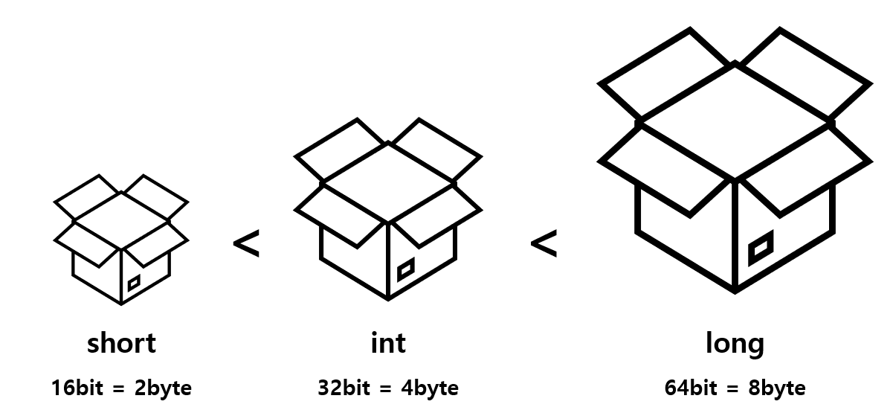

02 자료형과 연산자
===

# 1. 변수와 상수

## 변수와 상수

프로그램에는 반드시 데이터를 저장할 공간이 있어야 합니다. 예를 들어 학생들의 성적의 평균을 계산하는 프로그램이라면, 각각의 학생들의 성적이 입력되면 프로그램 어딘가에 그 학생들의 성적이 저장되어 있어야 합니다. 이때 사용하는 것이 **변수**입니다.

변수는 데이터를 담아두는 상자와 같다고 볼 수 있습니다. **변수는 언제든지 다른 값으로 변경이 가능합니다.** 반면에 값이 한번 정해지면 값을 변경할 필요가 없는 데이터들도 존재합니다. 

## 상수

- 100
- 3.14
- 'A'
- "Hello World!

이런 데이터를 **상수**라고 합니다. 상수는 프로그램이 실행되는 동안에 **값을 변경할 수 없습니다.**

상수라고 해서 꼭 정수나 실수만 존재하는 것은 아닙니다. 앞서 예제에서 보았던 "Hello World"라는 문자열도 실행 도중에 변하지 않기 때문에 상수입니다.

```c++
int main(){
    cout<<"Hello World!\n"; // 상수
    return 0;
}
```

## 변수 규칙

변수 이름은 몇가지 규칙이 있습니다. 변수 이름이나 함수의 이름은 모두 식별자의 일종 입니다. 식별자란 다른 것들과 구분되어 식별할 수 있는 것입니다. 그렇기에 구분을 위한 규칙이 있습니다.

- 식별자는 알파벳 문자와 숫자, 밑줄 문자('_')로 이루어집니다. 한글은 사용할 수 없습니다.

- 이름의 첫 번째 문자는 반드시 알파벳 또는 밑줄 문자여야 합니다. 그렇기에 숫자로 시작할 수 없습니다.

- 대문자와 소문자를 구별하기 때문에 서로 다른 것으로 취급됩니다. 따라서 index, Index, INDEX는 모두 서로 다른 변수입니다.

- **C++ 언어에서 지원하는 키워드(예약어)와 똑같은 이름은 허용되지 않습니다.**

- 변수의 길이에는 제한이 없습니다.

> 다음은 사용이 가능한 변수명 입니다.

```C++
sum
_count
number_of_pictures
King3
```

> 다음은 사용이 불가능한 변수명 입니다.

```c++
2nd_base            // 첫번째 문자는 숫자가 될 수 없습니다.
money#              // #은 사용할 수 없는 기호입니다.
best-student        // -는 사용할 수 없는 기호입니다.
double              // dobule은 c++의 키워드 입니다.
```

## 좋은 변수이름

좋은 변수 명은 코드를 볼 때 바로 그 의미를 알 수 있도록 정하는 것이 좋습니다.

년, 월, 일을 표현할 때 y, m, d 보다는 year, month, day가 더 의미를 파악하기에 좋습니다.

여러 단어로 이루어진 변수명이라면 kumoh_university 보다는 kumohUniversity로 단어의 구분을 대문자로 하는 방법이 좋습니다.

변수 이름을 지을 때 제일 중요한 것은 일관성이 있어야 합니다.

# 2. 자료형

자료형이란 데이터를 표현하는 형태를 의미합니다. 자료형의 종류가 많은 이유는 표현할 데이터의 종류와 크기가 다양하기 때문입니다.


# 3. 변수 선언

## 선언

> 자료형 변수명;

```c++
char c;
int size;
float pi;
double average;

int height, width;
```

## 초기화

변수에 값을 할당하는 것을 초기화라고 합니다. 초기화는 대입 연산자(=)를 통해서 할 수 있습니다.

```c++
char c = 'A';
int size = 20;
float pi = 3.14f;       //float형은 뒤에 f를 붙여줍니다.
double average = 1.4;

int height = 10, width = 20;
```

# 연습문제

1. 변수와 상수의 차이점?

2. 변수와 자료형의 관계?


# 4. 정수형

정수형은 가장 기본적인 데이터 타입으로 정수를 저장할 수 있습니다.



## 정수형이 다양한 이유?

수학에서 정수는 ..., -2, -1, 0, 1, 2, ... 와 같이 한가지 종류만 존재합니다. 하지만 메모리의 크기는 한정되어 있기 때문에 한 가지 타입만으로는 모든 정수를 나타낼 수 없습니다. 

또한 프로그래머가 용도에 따라서 선택할 수 있습니다. 비트 수가 늘어나면 수의 표현 범위가 늘어나지만 그만큼 메모리 공간이 더 필요로 합니다. 따라서 다양한 크기의 자료형을 제공함으로써 필요에 따라 적당한 크기의 정수 자료형을 선택하여 사용하도록 하기 위함입니다.

## 정수 자료형의 크기

```c++
#include <iostream>
#include <climits>
using namespace std;	// 이름 공간 설정

int main()
{
	short year = SHRT_MAX;		// 최대값으로 초기화한다.
	int sale = INT_MAX;			// 최대값으로 초기화한다.
	long total_sale = LONG_MAX;		// 최대값으로 초기화한다.

	cout <<"short형의 크기=" <<sizeof(short)<<endl;
	cout <<"int형의 크기=" <<sizeof(int)<<endl;
	cout <<"long형의 크기=" <<sizeof(long)<<endl<<endl;

	cout <<"short형의 최대값=" <<year<<endl;
	cout <<"int형의 최대값=" <<sale<<endl;
	cout <<"long형의 최대값=" <<total_sale<<endl<<endl;

	cout <<"short형의 최소값=" <<SHRT_MIN<<endl;
	cout <<"int형의 최대값=" <<INT_MIN<<endl;
	cout <<"long형의 최대값=" <<LONG_MIN<<endl<<endl;

	return 0;
}
```

> 결과

    short형의 크기=2
    int형의 크기=4
    long형의 크기=4

    short형의 최대값=32767
    int형의 최대값=2147483647
    long형의 최대값=2147483647

    short형의 최소값=-32768
    int형의 최대값=-2147483648
    long형의 최대값=-2147483648

